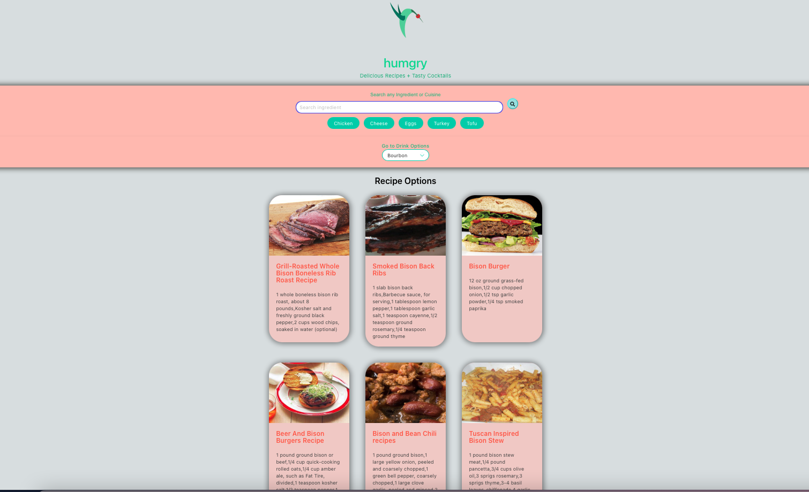
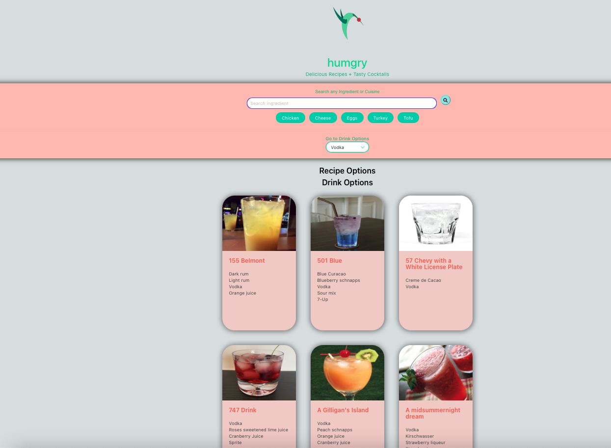

# Recipe and Cocktail Suggester
As a user I want to search for recipes using an ingredient or cuisine, when I search then I want to get recipe results in order to get a set of instructions for preparing a particular dish including a list of ingredients required. When I select a cocktail from the dropdown I also want to get a list of cocktails with images and ingredients.  

## Table of Contents

* [HTML](#HTML)
* [CSS](#CSS)
* [Javascript](#JS)
* [API's](#API's)
* [Installation](#Installation)

## HTML
Added an HTML with the basic structure and containers for the API data to come through as well as for the recipes and cocktails to all be added as cards on the page, including the search buttons with the icons from Fontawesome.com. Also added the hummingbird logo and the back to top button as well. 

## CSS
Added the appropriate styling for the page to match the criteria requested, including the styling for the buttons, input fields and container. 

## JS 
Added the three API's below in order to get the data on either click of buttons, value typed in the search bar or cocktail type selected in the dropdown. The data is then passed on through some loops which then create the innerHTML for the cards to display on the website with the data already populated on each card. Also added a clear function to clear the cards each time the button is clicked so that they don't accumulate on the screen. 

## API's 

* Edamam API for recipes, API being used through a Proxy server
* Cocktail DB API for cocktail suggestions
* Calling cocktail API a second time in order to get cocktail ingredients (first API only provided ID)

Link to deployed recipe and cocktail suggester: [Deployed site](https://jd-jaramillo.github.io/Recipe-and-Cocktail-Suggester/)

## Installation

There is no need to install anything, to use the recipe and cocktail suggester simply follow the link below. 

See deployed site here: [Deployed Site](https://jd-jaramillo.github.io/Recipe-and-Cocktail-Suggester/);

See repository here: [GitHub Repo](https://github.com/JD-Jaramillo/Recipe-and-Cocktail-Suggester);
 